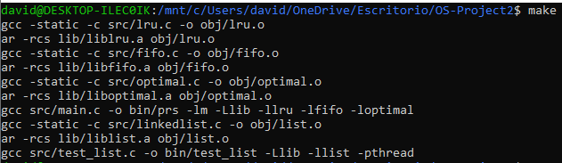
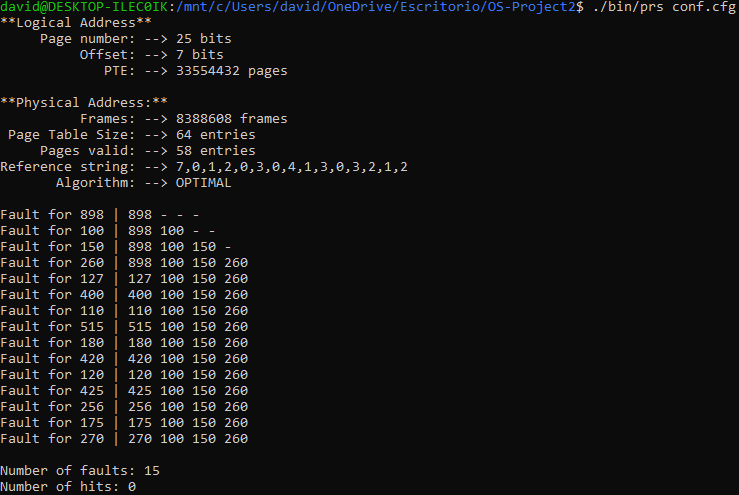
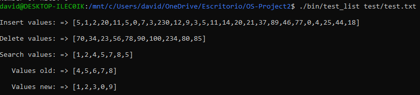
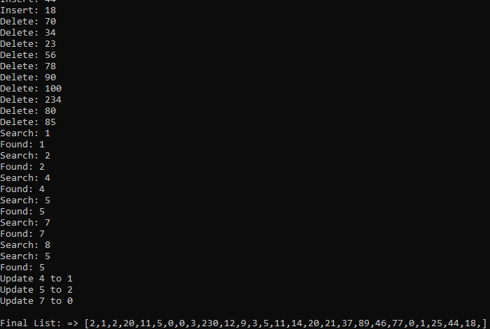

PROYECTO SEGUNDO PARCIAL
======================
Version 1.0 - 03/02/2020

1 - Descripción
---------------
* **Parte 1 - Simulador de remplazo de página** Consiste en desarrollar un programa que simule los algoritmos de reemplazo de página de una configuración determinada. El programa cargará un archivo de configuración desde la línea de comandos.

**El programa genera como salida lo siguiente:**

1. Estructura de dirección lógica: bits de página y bits de desplazamiento.
2. Estructura de dirección física: bits de trama y bits de desplazamiento.
3. Número máximo de entradas de tabla de páginas (PTE).
4. Número máximo de frames.
5. Tamaño en bytes necesarios para representar la tabla de páginas.
6. Número de páginas marcadas como válidas para el proceso.
7. Cadena de referencia basada en la secuencia de direcciones.
8. Tabla del algoritmo de reemplazo de página.
9. Resumen del número de Hits y Page Faults.

* **Parte 2 - Problema de concurrencia:** Programa que genera como salida una lista después de aplicarle las operaciones definidas en un archivo de testing. El programa desarrollado en C usa la librería pthread para maximizar el uso de los núcleos disponibles en el sistema,cada hilo se encargará de acceder a la lista y realizar una operación, se utilizan semáforos para sincronizar el trabajo de los hilos en las regiones críticas.

**Los hilos acceden a una lista vinculada para realizar estas operaciones:**

* **Search:** busca un elemento en la lista
* **Insert:** inserta un elemento al final de la lista
* **Update:** actualiza un elemento en la lista
* **Delete:** elimina un elemento de la lista


2 - Compilando el proyecto
----------------------------
El proyecto dispone de un archivo Makefile para compilar el código fuente.

* **Instrucciones para compilar:**
```
make
```

* **Para limpiar:**
```
make clean
```
Se generarán los ejecutables **prs** y **test_list** en el directorio **/bin**



3 - Modo de uso general
------------------------

* **Simulador de remplazo de página**
```
./bin/prs <conf.cfg>

```

* **Problema de concurrencia**

```
./bin/test_list <test/test.txt>

```
**Operaciones del archivo**



**Resultado de las operaciones**


**NOTA:** Para realizar el proyecto se usaron 4 librerías estáticas, 3 de ellas son algoritmos de remplazo de página y la restante corresponde a la lista enlazada.

4 - Estrategia
---------------
La estrategia utilizada para resolver el segundo problema planteado consiste en utilizar hilos para que accedan a la lista de forma simultánea, el propósito es poder maximizar el uso de los recursos disponibles.
Se decidió utilizar 4 hilos, los cuales accederán a la lista y se encargarán de manejar una sola operación, es decir, el primer hilo realizará operaciones de insertar y así sucesivamente. Se utilizan semáforos en las regiones críticas para resolver las condiciones de carrera, en este caso,la lista es el recurso compartido y sin el uso de un método para sincronización los valores variarán en cada ejecución. Para resolver el problema se hizo uso de semáforos,de esta forma las operaciones se realizarán en un orden adecuado y se evitará conflictos entre hilos que tratan de acceder a una misma posición de la lista para realizar una operación.

5.- Problemas y funcionalidades extras
---------------
> **Simulador de remplazo de página** 
* Se realizan todas las conversiones de unidades, y se muestra una tabla que refleja la secuencia que siguió el algoritmo de remplazo de página.

> **Problema de concurrencia**
* Se usan dos semáforos para manejar las críticas del programa.
* Se utiliza asignación de memoria dinámica para hilos,buffer y estructuras, luego dicha memoria reservada es liberada cuando ya no se necesita, con la finalidad de evitar fugas de memoria.
* Se muestran todas las operaciones realizadas a la lista, y una lista final con los elementos resultantes.

6 - Autor
-----------

* José David Neira Martrus